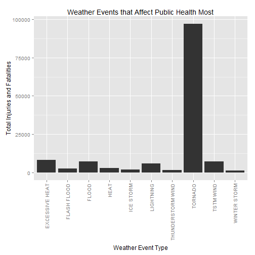
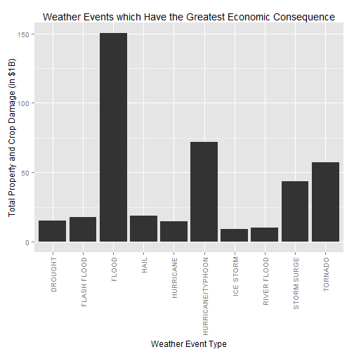

## Summary

The data analysis in this report shows how weather events can impact both in the arena of public health (via injuries and fatalities) and that of the local economy (via property and crop damage). Analysis reveals that tornadoes have the highest impact to public health while floods cause the most economic damage. 

## Data Acquisition


```r
## Download and unzip the data the data file
library(R.utils)
temp <- tempfile()
fileUrl = "https://d396qusza40orc.cloudfront.net/repdata%2Fdata%2FStormData.csv.bz2"
download.file(fileUrl, destfile = temp, mode = "wb")
bunzip2(temp,"repdata-data-StormData.csv", overwrite = TRUE, remove = FALSE)
unlink(temp)
```

## Data Processing


```r
## Manipulate data 
library(dplyr)
StormData <- read.csv("repdata-data-StormData.csv")
tbl_StormData <- tbl_df(StormData)
## Group by Event Type (EVTYPE)
by_EVTYPE_health <- group_by(tbl_StormData, EVTYPE)
##Find summary of cases, and arrange in descending order
PublicHealthSummary <- summarize(by_EVTYPE_health, total_injuries_fatalities = sum(FATALITIES, INJURIES))
PublicHealthSummary <- arrange(PublicHealthSummary, desc(total_injuries_fatalities))
## Take the top 10
TotPubHealthSum <- PublicHealthSummary[1:10, ]

## Multiply the property dand crop amage and copy damage cost by factor to put value in $1B
tbl_StormData$PROPDMGAct <- with(tbl_StormData, 
                             ifelse(PROPDMGEXP == "K", PROPDMG/1e+06,
                                    ifelse(PROPDMGEXP == "M", PROPDMG/1000,
                                           ifelse(PROPDMGEXP == "B", PROPDMG, 
                                                  0*PROPDMG))))
tbl_StormData$CROPDMGAct <- with(tbl_StormData, 
                             ifelse(CROPDMGEXP == "K", CROPDMG/1e+06,
                                    ifelse(CROPDMGEXP == "M", CROPDMG/1000,
                                           ifelse(CROPDMGEXP == "B", CROPDMG, 
                                                  0*CROPDMG))))
## Group by EVTYPE
by_EVTYPE_econ <- group_by(tbl_StormData, EVTYPE)
##Find summary of cases, and arrange in descending order
EconConseqSummary <- summarize(by_EVTYPE_econ, total_economic_damage = sum(PROPDMGAct, CROPDMGAct))
EconConseqSummary <- arrange(EconConseqSummary, desc(total_economic_damage))
## Take the top 10
TotEconConseqSum <- EconConseqSummary[1:10, ]
```

## Figures

Figure 1. This figure shows the top 10 events to impact public health. Clearly tornadoes have the largest impact.


```r
library(ggplot2)
TotPubHealthSum
```

```
## Source: local data frame [10 x 2]
## 
##               EVTYPE total_injuries_fatalities
## 1            TORNADO                     96979
## 2     EXCESSIVE HEAT                      8428
## 3          TSTM WIND                      7461
## 4              FLOOD                      7259
## 5          LIGHTNING                      6046
## 6               HEAT                      3037
## 7        FLASH FLOOD                      2755
## 8          ICE STORM                      2064
## 9  THUNDERSTORM WIND                      1621
## 10      WINTER STORM                      1527
```

```r
q <- qplot(EVTYPE, data = TotPubHealthSum, geom = "bar", weight = total_injuries_fatalities,
           main = "Weather Events that Affect Public Health Most",
           xlab = "Weather Event Type",
           ylab = "Total Injuries and Fatalities")
q + theme(axis.text.x = element_text(angle = 90, hjust = 1, vjust = 0.5))
```

 

Figure 2. This figure shows the top 10 events to impact the economy. Clearly floods have the largest impact.


```r
TotEconConseqSum
```

```
## Source: local data frame [10 x 2]
## 
##               EVTYPE total_economic_damage
## 1              FLOOD               150.320
## 2  HURRICANE/TYPHOON                71.914
## 3            TORNADO                57.341
## 4        STORM SURGE                43.324
## 5               HAIL                18.753
## 6        FLASH FLOOD                17.562
## 7            DROUGHT                15.019
## 8          HURRICANE                14.610
## 9        RIVER FLOOD                10.148
## 10         ICE STORM                 8.967
```

```r
q <- qplot(EVTYPE, data = TotEconConseqSum, geom = "bar", weight = total_economic_damage,
           main = "Weather Events which Have the Greatest Economic Consequence",
           xlab = "Weather Event Type",
           ylab = "Total Property and Crop Damage (in $1B)")
q + theme(axis.text.x = element_text(angle = 90, hjust = 1, vjust = 0.5))
```

 


